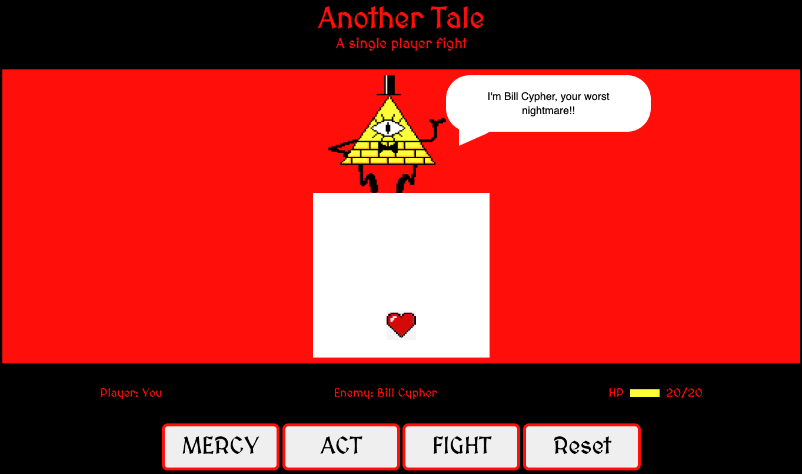
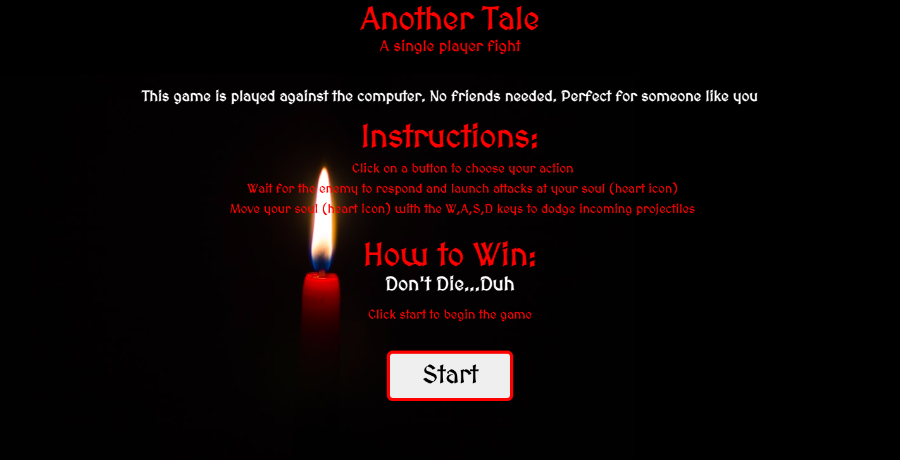
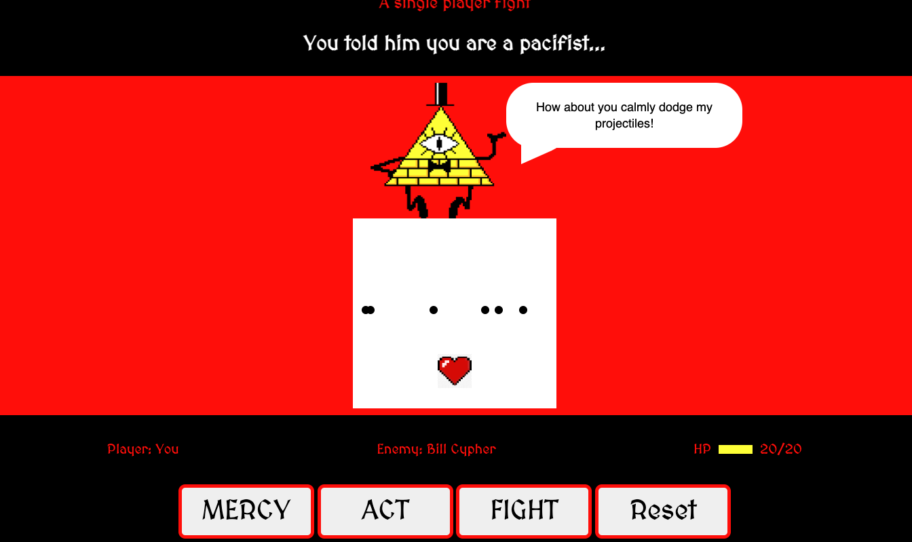
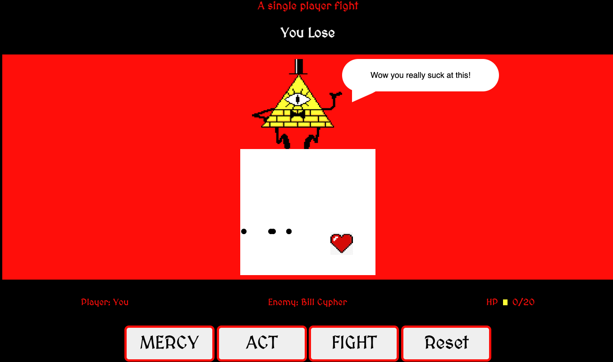

# Project-1

# H2 Game Title : Another Tale

# H2 Overview:

**Undertale** is a hit RPG (role playing game) that follows the main character as they traverse through the underground and encounter various monsters that engage the character in fights. There's just one catch... _you don't have to fight_.
Every fight is filled with humor and unexpected options as the character attempts to protect their soul (a small heart icon) from incoming projectiles. **This game is inspired by Undertale.** Enjoy!

# H2 User should be able to:

1.  Be greeted by a welcome screen that features instructions and a start button

2.  Begin the game by clicking "Start Game"

3.  Be brought to Game Page where the user plays

4.  Encounter the enemy and choose between "Fight", "Act" and "Mercy"

5.  Receive a text box displaying the corresponding action followed by the enemy's reponse (another text box)

6.  Control their soul (a small heart icon) to dodge incoming projectiles using W, A, S, D when the enemy attacks

7.  Be able to see their health through an HP bar and numeric counter

8.  Repeat sequence until the user receives a "You Win" prompt after surviving "x" amount of rounds of projectiles or lose when their HP hits 0.

9.  Be able to restart the game at any moment using a reset button.

# Version 1 Screens:

- Welcome Screen
  

- Game Start Screen
  

- Action Screen

- Loser Screen

# Technology Used :

- HTML
- CSS
- JavaScript

# Initial Mockup Pictures:

- Title Screen
  

- Fight Screen
  

- Action Screen

